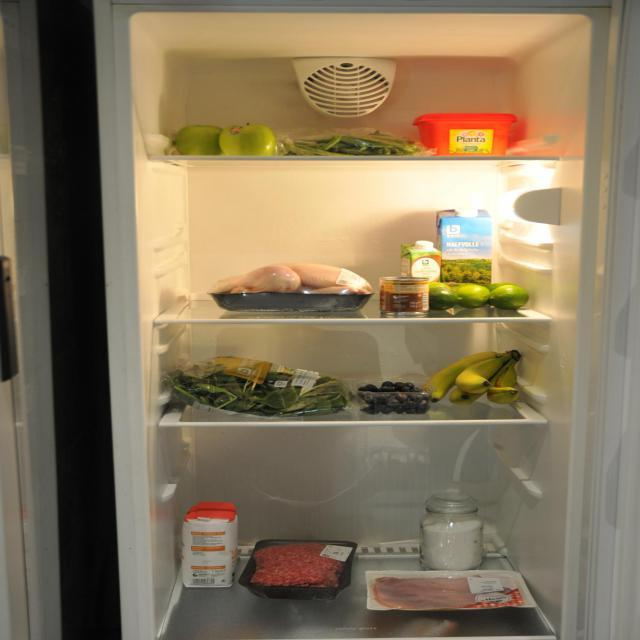
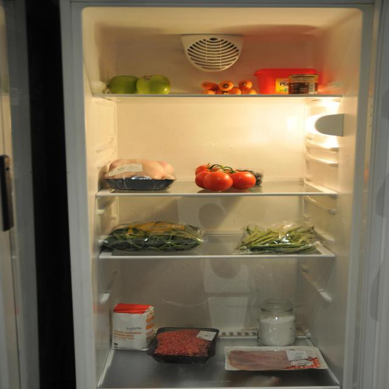
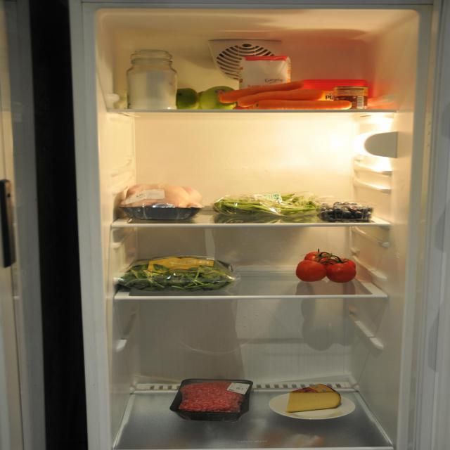
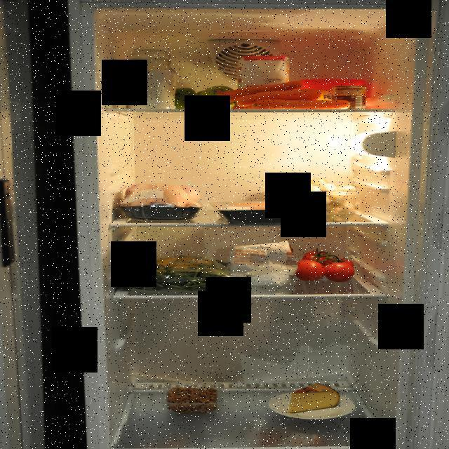
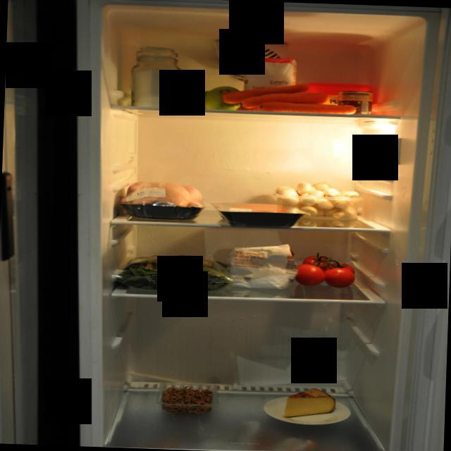

# GAN-Based Food Classification for Smart Refrigerators 🍎🥦🥩

## MSc Dissertation Project — Northumbria University (2:1)

> *"An Improved Computer Vision Model for Food Classification in Smart Refrigerators using GAN-Based Data Augmentation"*

**Author:** Premshakthi Sekar | MSc Artificial Intelligence | Northumbria University, UK  
**Supervisor:** Dr Bing Zhai | **Grade:** 2:1

---

## 🧠 Project Overview

This project investigates whether **Generative Adversarial Networks (GANs)** can improve the performance of a food image classification system designed for smart refrigerators. The system detects and classifies food items visible inside a refrigerator, with applications in stock management, recipe recommendations, and energy efficiency.

The core research question: *Can GAN-based data augmentation address class imbalance and improve CNN classification accuracy on a limited real-world dataset?*

---

## 🖼️ Dataset

Real refrigerator images were collected and annotated using **Roboflow** with bounding box labels across 30 food categories including:

`apple · banana · tomato · carrot · chicken · minced meat · cheese · blueberries · green beans · mushroom · and more`

| Property | Value |
|----------|-------|
| Total images | 3,148 |
| Classes | 30 food categories |
| Annotation format | YOLO bounding boxes |
| Collection method | Custom refrigerator photography |
| Full dataset | [Roboflow Universe →](https://universe.roboflow.com/project-9e2x4/fridge-detection) |

> 📦 **Full dataset** (images + YOLO annotations) sourced from Roboflow Universe: [Fridge Detection Dataset →](https://universe.roboflow.com/project-9e2x4/fridge-detection)

### Sample Dataset Images
*Real refrigerator images used for training:*

  

---

## 🔄 Pipeline

```
Real Dataset → Dataset Preparation → Baseline CNN → GAN Training → Augmented Dataset → Improved CNN → Evaluation
```

| Notebook | Description |
|----------|-------------|
| `01_dataset_preparation.ipynb` | Load annotations, analyse class distribution, organise images into class folders |
| `02_baseline_classifier.ipynb` | Train MobileNetV2 CNN on original dataset (no augmentation) |
| `03_gan_training.ipynb` | Train GAN to generate synthetic food images |
| `04_improved_classifier_with_gan.ipynb` | Train improved CNN on GAN-augmented dataset |

---

## 🤖 GAN Architecture

### Generator
Transforms a 100-dimensional noise vector into an 80×80 RGB synthetic image:

```
Input (noise: 100d) → Dense → Reshape (20×20×128) → Conv2DTranspose × 2 → Output (80×80×3)
```

### Discriminator
Binary classifier distinguishing real from generated images:

```
Input (80×80×3) → Conv2D × 2 (LeakyReLU + Dropout) → Flatten → Dense(1, sigmoid)
```

### GAN-Generated Images
The images below show the GAN output at different training stages. Early epochs produce noisy artefacts — this is expected GAN behaviour. Quality improves significantly over 10,000 training epochs.

| Early Stage (Noisy) | Later Stage (Improved) |
|---------------------|----------------------|
|  |  |

> ⚠️ Full GAN training took approximately **7 days** on available hardware (10,000 epochs, batch size 64)

---

## 📊 Results

| Model | Test Accuracy | Epochs | Dataset |
|-------|--------------|--------|---------|
| Baseline (No GAN) | ~46% | 200 | Original only |
| **Improved (With GAN)** | **~51%** | **100** | **Original + GAN synthetic** |

### Key Findings
- ✅ GAN augmentation provided a **~5% improvement** in test accuracy
- ⚠️ **Overfitting** remained a challenge — high training accuracy vs lower validation accuracy
- 📉 Class-wise performance varied significantly across the 30 food categories
- 🔍 GAN image quality improved over training epochs but early outputs showed visible noise artefacts

---

## 🛠️ Tech Stack


- **Deep Learning:** TensorFlow / Keras
- **Base Model:** MobileNetV2 (ImageNet pre-trained, transfer learning)
- **GAN:** Custom Generator + Discriminator (Conv2DTranspose / Conv2D)
- **Data:** Roboflow annotated refrigerator dataset
- **Evaluation:** Accuracy, Loss, Confusion Matrix, Classification Report

---

## 🚀 How to Run

### 1. Clone the repository
```bash
git clone https://github.com/Premshakthi-Sekar/gan-food-classification.git
cd gan-food-classification
```

### 2. Install dependencies
```bash
pip install tensorflow scikit-learn pillow pandas matplotlib seaborn openpyxl
```

### 3. Add your dataset
```
dataset/
├── images/          ← Original images (organised by class)
├── gan_images/      ← Images used for GAN training
└── augmented_images/← Original + GAN-generated images combined
```

### 4. Run notebooks in order
```
01_dataset_preparation.ipynb  →  02_baseline_classifier.ipynb  →  03_gan_training.ipynb  →  04_improved_classifier_with_gan.ipynb
```

> ⚠️ **GAN training (Notebook 3) is computationally intensive.** Expected runtime: several days on CPU. GPU strongly recommended.

---

## 📁 Repository Structure

```
gan-food-classification/
├── 01_dataset_preparation.ipynb
├── 02_baseline_classifier.ipynb
├── 03_gan_training.ipynb
├── 04_improved_classifier_with_gan.ipynb
├── sample_images/
│   ├── sample1.jpg         ← Real dataset samples
│   ├── sample2.jpg
│   ├── sample3.jpg
│   ├── gan_early.jpg       ← GAN output early training
│   └── gan_later.jpg       ← GAN output later training
└── README.md
```

---

## 🔮 Future Work
- Advanced GAN architectures (DCGAN, StyleGAN) for higher quality synthetic images
- Model regularisation (L2, Batch Normalisation) to reduce overfitting
- Real-time inference integration for smart refrigerator deployment
- Larger and more diverse dataset collection

---

## 👤 Author

**Premshakthi Sekar**  
MSc Artificial Intelligence · Northumbria University, Newcastle, UK · 2022–2023  
[](https://www.linkedin.com/in/premshakthi-sekar-a6a328156)
